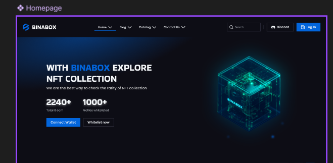
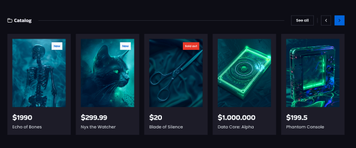
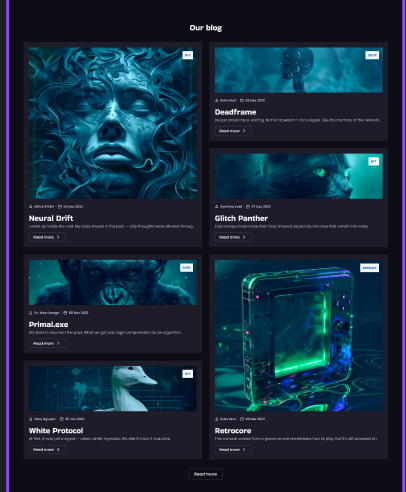

# binabox-quinta-blip

**student**:.Quinta.Nahbum

**Mentor**:.Zoia.Rassadkina

--

## Description

- BINABOX is a platform for exploring NFT collections
- Users can check rarity, view products, and access blog content 

## Features

- Browse NFT catalog with images
- Read articles in blog section
- Connect wallet and Whitelist
- Interactive FAQ and Team section

---

## Installation

1. Clone the repository:
```bash
git clone <your-repo-url>
cd bro1
```
2. Install dependencies:
```bash 
npm install
``` 

## Build Commands

1. Start development server:
```bash
npm run dev 
```
2. Build for production:
```bash
npm run build 
```
3. Preview production build:
```bash
npm run preview
```             


## Usage

- Open index.html to view the homepage

- Navigate to Blog, Catalog, About, and Contact pages via the menu

- Styles are written in src/styles/style.scss and compiled automatically


## Screenshots
 Homepage banner:  
   


 Catalog section:  
 

 
 Blog section:  
 


## Technologies Used

- HTML5 & SCSS

- Twig templating system

- Node.js & npm

- Vite for development and build

- PostCSS for CSS features


## Project Structure
- src/assets/icons → SVG icons for your project
- src/assets/images → Images for your project
- src/styles → SCSS stylesheets
- src/data → JSON data
- src/templates/layouts → Twig layouts
- src/templates/partials → Twig partials

